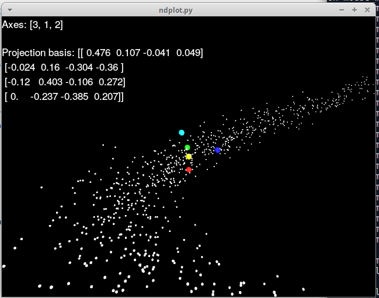

# ndplot

high-dimensional viewer, by projecting onto a 3d hypercube.  Use the mouse to rotate the 3d projection hypercube.

This doesnt really work as well as I hoped it would.

The concept is:
- project onto 3d hypercube/plane
- can rotate the 3d projection freely, to view it from any angle (simply drag the mouse, with or without ctrl
key, to do this;  pressing ctrl key changes the left-right drag axis)
- can use `w` key to change the rotation axes, into a hyper-axis; and then drag the mouse, to drag around in hyperspace

This sort of works.  But I dont find being able to drag around in 4 dimensions as useful as I thought I would...

Anyway, this is what I have for now.

I looked at the following earlier projects before writing this:

- hypertools https://github.com/ContextLab/hypertools  Seems nice, but based on matplotlib, so limited possibility to customize how one drags around the viewport?  and customize the UI etc
- https://github.com/mikasarkinjain/hyperdimensional-data-visualization  Sounds similar to what I'm trying here, but it's implemented in a language called "Processing", which is java-like (I think?)

I also looked briefly at how https://github.com/facebook/UETorch is implemented, or at least, what engine they are using.  They are using Unreal engine.  I think that's overkill for what I have/had in mind :-P

In other news, I think [Pyglet](https://bitbucket.org/pyglet/pyglet/wiki/Home), which I'm using here, works quite well for what I want/wanted:
- handles key presses with almost no effort, and mouse drags
- opengl, of course
  - (and the opengl wrapping works pretty nicely, no major 'ow!' points or anything)
- didnt take much effort to put a 2d hud on it
